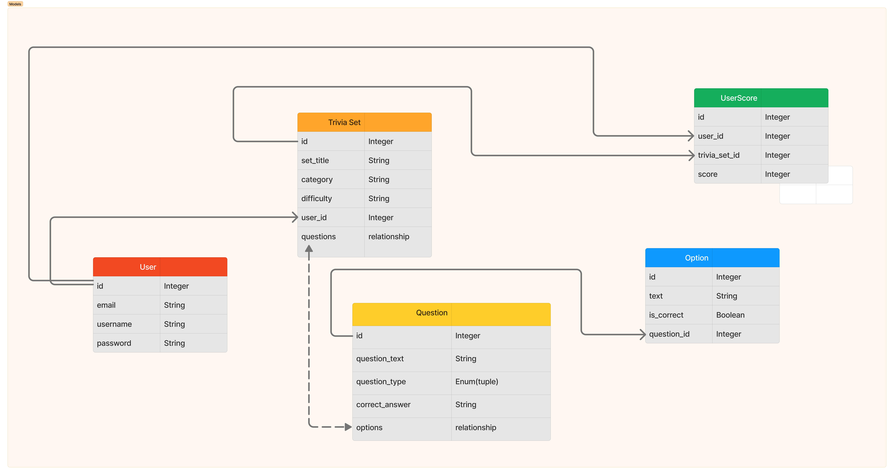

<a name="top"></a>
<details>
<summary>Table of Contents</summary>

+ [About The Project](#about-the-project)
    + [Features](#features)
    + [Built With](#built-with)
+ [Getting Started](#getting-started)
    + [Prerequisites](#prerequisites)
    + [Installation](#installation)
    + [Usage](#usage)
    + [Roadmap](#roadmap)
+ [Contributing](#contributing)
+ [Contact](#contact)
+ [License](#license)
+ [Acknowledgments](#acknowledgments)
</details>  
<br>

# About The Project

MultiNerd Trivia is a full-stack application with user authentication, designed for trivia enthusiasts. It allows users to select trivia sets to play from a customized collection, which can be contributed to by any user.


### Features

User authentication: Secure registration and login system.  
Customized trivia collection: Users can contribute to collection by adding their own Trivia sets in any category.  
Select trivia sets: Choose from a wide range of trivia sets to play.  
Engaging gameplay: Enjoy trivia quizzes and test your nerdy knowledge.  

### Built With


[Back To Top](#top)


## Getting Started 

### Prerequisites

Before you start, make sure you have the following installed:
<uL>
<li>Python</li>
<li>Flask</li>
<li>SQLite</li>
</ul>


### Installation

1. Clone the repository:
```
git clone https://github.com/Ctrl-Alt-Defeat-200/trivia_app_v4.git
```

2. Create a virtual environment and activate it:
```
python -m venv venv
source venv/bin/activate
```

3. Install project dependencies:
```
pip install -r requirements.txt
```

4. Set up your database using SQLite and configure it in the project.  

5. Start the Flask server  

6. Visit `http://127.0.0.1:5000/` in your web browser

<br>

| Dependencies | Version|
| ----------- | ----------- |
| Flask | 2.3.3  |
| Flask-Login | 0.6.2 |
| Flask-SQLAlchemy | 3.1.1 |
| Flask-Migrate | 3.1.0 
| Werkzeug | 2.3.7  |  
The info in this table can be found in the project's requirements.txt file
 


### Usage

1. Register or log in to your MultiNerd Trivia account
2. Browse the collection of trivia sets contributed by other users. OR Create your own!
3. Select a trivia set and start playing!
<br>

[Back To Top](#top)  

---

### Roadmap

Our team embraced an Agile Scrum methodology to efficiently manage the development of MultiNerd Trivia. We divided the project into sprints, each with specific goals, and followed a collaborative and iterative process. Here's a breakdown of our development process, including the incorporation of user stories:

> **Conceptualization Phase**: 
> Initial brainstorming sessions to define the project scope and objectives.
> Creation of a concept map to visualize overall structure of the application
>   
> 

**Sprint Planning**:
- Dividing the project into manageable sprints with specific goals.
- Assigning roles to team members and defining their responsibilities.
- Prioritizing user stories and creating a backlog based on the needs of our personas.
 
<br>

> **Modeling and Design:** 
>   
>Creating models and diagrams to outline the data structure and relationships.
>-  Identifying high-priority user stories to address design and functionality requirements.
> Identification of target user personas and their needs.
>   
>-  High-priority user stories were identified, such as:
  
<br>  

**Development and Testing**
- Writing code in Python using the Flask framework.
- Integration of SQLite for the database.
- Implementing user authentication and data storage.
- Regular testing and debugging to ensure code quality and functionality.  
<br>

>**User Interface(UI) Design:**
>- Designing the UI using HTML, CSS, 
>- Ensuring responsiveness for different devices and screen sizes  
<br>


**Collaborative Tools:**
- Utilizing collaboration tools like Figma for UI/UX design  

- Managing the codebase, issues and pull requests on Github  

  

<br>

 


[Back To Top](#top)  


## Contributing 

We welcome contributions to MultiNerd Trivia! To contribute:

1. Fork the repository
2. Create a new branch for your feature or bugfix:
```
git checkout -b feature/your-feature-name
```
3. Commit your changes and push to your branch:
```
git commit -m "Add your feature"
git push origin feature/your-feature-name
```

4. Open a pull request, and we'll review your changes.

<br>
<br>  

 
**The Core Team**  
[Ashley Buono](https://github.com/ashleygbuono)  
[Leonora Squires](https://github.com/jukebox101)  
[Debbie Augustin](https://github.com/DebbieAugustin)  
[Laura Minaya](https://github.com/lminaya0110)

**GitHub Org**  
[Ctrl-Alt-Defeat-200](https://github.com/Ctrl-Alt-Defeat-200) 


## License

This project is licensed under the [MIT License.]()

## Contact

  
[Ashley Buono](https://www.linkedin.com/in/ashley-buono/),  
[Leonora Squires](https://www.linkedin.com/in/leonora-squires-65681798/),  
[Debbie Augustin](https://www.linkedin.com/in/debbie-augustin-cyber/),  
[Laura Minaya](https://www.linkedin.com/in/lauraminaya/).

## License

Distributed under the MIT License. See LICENSE for more information. 

## Acknowledgments

We would like to extend our heartfelt appreciation to everyone who contributed to the success of MultiNerd Trivia. This project was made possible through the collective efforts and support of many individuals and organizations.

- Interapt: We are grateful to our employer, Interapt, for encouraging and supporting our project. Your belief in our vision and commitment to innovation have been invaluable.

- Instructors Chuck and Lou: Special thanks to our instructors, Chuck and Lou, for their guidance, mentorship, and unwavering support throughout the development process. Your expertise and encouragement have been instrumental in our journey.

- Our Collaborative Team: MultiNerd Trivia wouldn't have been possible without the dedication and hard work of our team members. Each member contributed their unique skills and insights, resulting in a truly collaborative effort. 

We would like to express our sincere gratitude to everyone involved in making MultiNerd Trivia a reality. Your support and encouragement have been invaluable on this journey.

Made by : *Ash, Leo, Debbie and Laura* aka **Ctrl-Alt-Defeat-200**  

ABC
: "Always Be Coding" - Lou Marco

[Back To Top](#top)

